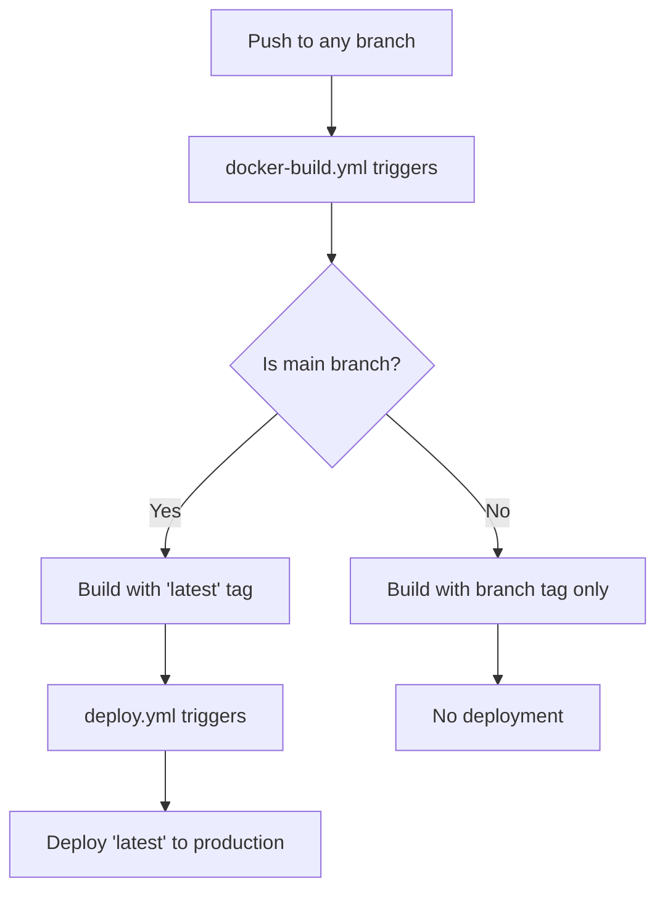

# GitHub Actions Workflows

This repository uses GitHub Actions for automated building and deployment.

## Workflow Overview

### 🔨 Build and Push Docker Image (`docker-build.yml`)
**Triggers:** Push to any branch, Pull requests to main
**Purpose:** Builds Docker images for all branches with appropriate tags

- **Any branch:** Creates `<branch-name>` and `sha-<commit>` tags
- **Main branch:** Additionally creates `latest` tag for production
- **Pull requests:** Creates `pr-<number>` tags

### 🚀 Deploy to Production (`deploy.yml`)
**Triggers:** Only when main branch docker-build completes successfully
**Purpose:** Deploys the `latest` Docker image to production

- Runs on self-hosted runner
- Pulls `latest` tag from Docker Hub
- Deploys to production environment
- Includes health checks and cleanup

## Workflow Flow

## Branch Strategy

- **main**: Production deployments (creates `latest` tag)
- **feature branches**: Development builds (branch-specific tags)
- **Pull requests**: Review builds (PR-specific tags)

## Docker Tags

| Branch Type | Tags Created | Deployment |
|-------------|--------------|------------|
| main | `latest`, `main`, `sha-<commit>` | ✅ Auto-deploy |
| feature/* | `<branch>`, `sha-<commit>` | ❌ No deploy |
| PR | `pr-<number>`, `sha-<commit>` | ❌ No deploy |

## Status Badges

